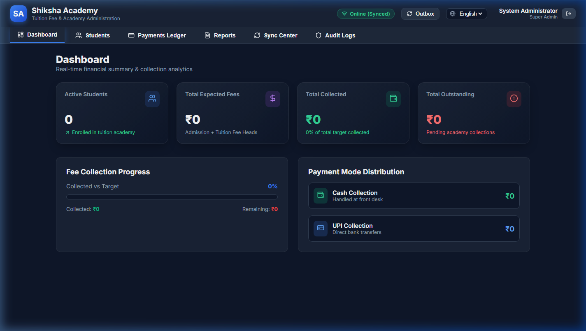

# 🎓 Shiksha Academy — Production Fee Management System

[](https://siksha-bice.vercel.app)
[](https://siksha-mglz.onrender.com/health)
[](https://supabase.com)
[](LICENSE)

An enterprise-grade, offline-first Progressive Web Application (PWA) and REST API built for tuition academies to manage student admissions, fee structures, payment collections, and financial audit logs with high concurrency safety and offline synchronization.

---



---

## 🚀 Live Production Environment

- **Production Web Application (Vercel)**: [https://siksha-bice.vercel.app](https://siksha-bice.vercel.app)
- **Production REST API (Render)**: [https://siksha-mglz.onrender.com](https://siksha-mglz.onrender.com)
- **API Health Check**: [https://siksha-mglz.onrender.com/health](https://siksha-mglz.onrender.com/health)

---

## 🛠️ System Architecture

```text
       Browser / Mobile PWA (React 19 + TypeScript + Vite)
                                │
                                ├── Offline Storage (Dexie.js IndexedDB)
                                └── Offline Outbox Sync Engine
                                        │
                                  HTTPS REST API
                                        ▼
                      FastAPI Backend Server (Render)
                                │
                                ├── Row-Level Lock (SELECT ... FOR UPDATE)
                                ├── PBKDF2 / Bcrypt Authentication
                                └── SQLAlchemy 2.0 ORM
                                        │
                                  PostgreSQL SSL
                                        ▼
                      Supabase Managed PostgreSQL
```

---

## ✨ Key Features

1. **Atomic Concurrency-Safe Payment Processing**:
   - Implements PostgreSQL row-level pessimistic locking (`SELECT ... FOR UPDATE`) on student fee accounts.
   - Prevents simultaneous overpayments across multiple cashiers operating at the desk.

2. **Offline-First PWA Synchronization**:
   - Full offline support backed by Dexie IndexedDB.
   - Offline Outbox pattern queues payments locally when internet connectivity is lost.
   - PBKDF2 password derivation (100,000 iterations) for secure offline staff authentication.

3. **Auditable Payment Correction Quarantine**:
   - Payment corrections require a mandatory audit reason and are logged directly to the system audit trail.

4. **Multi-Head Fee Management**:
   - Class-based admission and tuition fee structures.
   - Supports Cash and UPI payment modes with instant PDF receipt generation.

5. **Role-Based Access Control (RBAC)**:
   - Fine-grained permissions covering Super Admin, Fee Administrator, and Staff roles.

---

## 🧰 Technology Stack

| Component | Technology | Description |
| :--- | :--- | :--- |
| **Frontend Framework** | React 19 + TypeScript | UI component layer |
| **Build Tool** | Vite 8 | Ultra-fast PWA bundling & HMR |
| **Styling** | Vanilla CSS + Glassmorphism | Custom responsive theme |
| **Offline Database** | Dexie.js (IndexedDB) | Client-side persistent storage |
| **PDF Reporting** | jsPDF + jsPDF-AutoTable | Instant client-side receipt generation |
| **Backend Framework** | FastAPI (Python 3.11+) | High-performance async REST API |
| **ORM & DB Layer** | SQLAlchemy 2.0 + psycopg2 | Relational data modeling & migrations |
| **Production DB** | Supabase PostgreSQL | Serverless PostgreSQL database |
| **Authentication** | PassLib (pbkdf2_sha256) + JWT | Secure token authentication |

---

## 💻 Local Development Setup

### Prerequisites
- Node.js v18+
- Python 3.11+
- Git

### 1. Clone Repository
```bash
git clone https://github.com/laknanitish2110-sudo/siksha.git
cd siksha
```

### 2. Backend Setup (`apps/api`)
```bash
# Navigate to backend directory
cd apps/api

# Create virtual environment
python -m venv .venv
source .venv/bin/activate  # Windows: .venv\Scripts\activate

# Install dependencies
pip install -r requirements.txt

# Run backend development server
uvicorn app.main:app --reload --port 8000
```

### 3. Frontend Setup (`apps/web`)
```bash
# Open new terminal at repository root
cd apps/web

# Install dependencies
npm install

# Start Vite dev server
npm run dev
```

The frontend will start at `http://localhost:5173` and communicate with `http://localhost:8000/api/v1`.

---

## 🚢 Deployment Guide

Detailed step-by-step production deployment instructions for Vercel, Render, and Supabase are documented in [`DEPLOYMENT.md`](file:///c:/Users/rajes/OneDrive/Desktop/shiksha/DEPLOYMENT.md).

---

## 📜 License

This project is licensed under the MIT License - see the [LICENSE](LICENSE) file for details.
